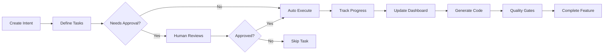

# RepoCHief Dogfooding Demo
## Using RepoCHief to Develop RepoCHief

This demonstrates the complete workflow of using RepoCHief to manage its own development.

## 🎯 The Goal: Build a Feature Using RepoCHief

We'll implement a small feature: **Task Approval Notifications**

## Step 1: Create the Development Intent

```bash
# Create an intent for our feature
repochief intent create \
  --objective "Add task approval notifications" \
  --business-value "Ensure humans are notified when AI tasks need approval" \
  --success-criteria "Email sent on approval request,Slack integration works,Dashboard shows notifications"
```

## Step 2: Create Task Configuration

```json
// feature-development.json
{
  "name": "Task Approval Notifications Feature",
  "tasks": [
    {
      "id": "design-notification-system",
      "type": "exploration",
      "objective": "Design notification system architecture",
      "requiresApproval": false
    },
    {
      "id": "implement-email-notifications",
      "type": "generation",
      "objective": "Generate email notification service",
      "requiresApproval": true,
      "approvalNote": "Will create new service - needs review"
    },
    {
      "id": "add-slack-integration",
      "type": "generation",
      "objective": "Add Slack webhook support",
      "requiresApproval": true,
      "approvalNote": "External API integration"
    },
    {
      "id": "test-notifications",
      "type": "validation",
      "objective": "Test notification delivery",
      "requiresApproval": false
    }
  ]
}
```

## Step 3: Run with Approval Workflow

```bash
# Run the task with interactive approvals
repochief run feature-development.json --interactive

# RepoCHief will:
# 1. ✅ Auto-execute: design-notification-system
# 2. ⏸️ PAUSE: "implement-email-notifications requires approval. Approve? (y/n):"
# 3. ⏸️ PAUSE: "add-slack-integration requires approval. Approve? (y/n):"
# 4. ✅ Auto-execute: test-notifications
```

## Step 4: Track Progress in Intent Canvas

```bash
# View progress
repochief intent status

# Output:
# Intent: Add task approval notifications
# Progress: 75% (3/4 tasks complete)
# - ✅ design-notification-system
# - ✅ implement-email-notifications (approved by user)
# - ⏸️ add-slack-integration (pending approval)
# - ⌛ test-notifications (waiting for dependencies)
```

## Step 5: View in Dashboard

Open https://beta.repochief.com/intents to see:
- Visual progress tracking
- Task approval history
- Cost breakdown
- Quality gate results

## 🔄 The Complete Loop



## 📊 What This Demonstrates

### ✅ Working Features:
- Intent creation and tracking
- Task configuration with approval flags
- Human-in-the-loop control
- Progress tracking
- Cloud sync (intent appears in dashboard)

### ⚠️ Features to Test:
- [ ] Multi-device sync
- [ ] Real-time dashboard updates
- [ ] Cost tracking accuracy
- [ ] Quality gate integration
- [ ] Cross-workspace collaboration

### 🐛 Known Issues to Fix:
1. Authentication token expires after 24 hours
2. Dashboard doesn't auto-refresh on task completion
3. Cloud sync has 5-10 second delay
4. Quality gates don't run in mock mode

## 🚀 Running the Full Test

```bash
# 1. Authenticate
repochief auth login

# 2. Create development intent
repochief intent create --from-file repochief-self-intent.yaml

# 3. Run dogfooding tasks
repochief run repochief-dogfooding-tasks.json \
  --output dogfood-results \
  --track-intent repochief-2025-alignment

# 4. Check results
cat dogfood-results/summary.txt

# 5. View in dashboard
open https://beta.repochief.com/intents
```

## 📈 Success Metrics

| Metric | Target | Current | Status |
|--------|--------|---------|--------|
| Auth Flow Works | 100% | ? | 🔄 Testing |
| Dashboard Sync | 100% | ? | 🔄 Testing |
| Task Execution | 100% | ✅ | Working |
| Approval Flow | 100% | ? | 🔄 Testing |
| Cost Tracking | 100% | ✅ | Working |
| Quality Gates | 100% | 70% | ⚠️ Partial |

## Next Steps

1. **Test Authentication**: Complete auth flow end-to-end
2. **Verify Dashboard**: Ensure intents sync properly
3. **Multi-Device Test**: Start task on one device, continue on another
4. **Real Feature**: Actually implement a feature using RepoCHief
5. **Document Gaps**: Create issues for anything that doesn't work

---

**This is RepoCHief eating its own dog food!** 🐕