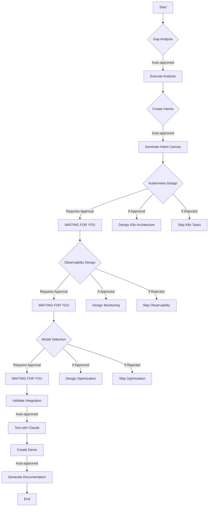

# RepoCHief Approval Workflow for Self-Development

## Current Status: AWAITING APPROVAL

### 📋 Tasks Pending Your Approval:

#### ✅ Auto-Approved (Already Safe to Execute):
1. **Gap Analysis** - Analyze current vs 2025 best practices
2. **Intent Creation** - Create Intent Canvas entries
3. **Claude Integration Validation** - Test integration with Claude Code
4. **Dogfooding Demo** - Create self-management demonstration

#### ⏸️ Requires Your Explicit Approval:
1. **Kubernetes Deployment Architecture**
   - Estimated Cost: $0.10
   - Estimated Time: 2-3 weeks
   - Risk: Medium (infrastructure change)
   - **Your Decision**: [ ] Approve  [ ] Reject  [ ] Defer

2. **Observability Stack Design**
   - Estimated Cost: $0.08
   - Estimated Time: 1-2 weeks
   - Risk: Low (additive feature)
   - **Your Decision**: [ ] Approve  [ ] Reject  [ ] Defer

3. **Model Selection Engine**
   - Estimated Cost: $0.12
   - Estimated Time: 3-4 weeks
   - Risk: Medium (core logic change)
   - **Your Decision**: [ ] Approve  [ ] Reject  [ ] Defer

## How to Use This Workflow:

### Option 1: Run RepoCHief with Approval Prompt
```bash
# Run with interactive approval
node repochief-cli/bin/repochief.js run repochief-development-tasks.json \
  --mock \
  --interactive \
  --output repochief-self-development-output

# RepoCHief will pause at each approval point and ask:
# "Task 'design-kubernetes-architecture' requires approval. Approve? (y/n/skip):"
```

### Option 2: Pre-Configure Approvals
```bash
# Create approval file
cat > task-approvals.json << EOF
{
  "design-kubernetes-architecture": "skip",
  "design-observability-stack": "skip", 
  "design-model-selection-engine": "skip"
}
EOF

# Run with pre-configured approvals
node repochief-cli/bin/repochief.js run repochief-development-tasks.json \
  --mock \
  --approvals task-approvals.json \
  --output repochief-self-development-output
```

### Option 3: Use Intent Canvas for Visual Management
```bash
# Import intent into RepoCHief
repochief intent import repochief-self-intent.yaml

# View in dashboard
open https://beta.repochief.com/intents

# Approve/reject tasks through UI
```

## Current Execution Plan:



## Why This Workflow Matters:

1. **Human Control**: You decide what gets implemented
2. **Cost Management**: You see costs before approval
3. **Risk Mitigation**: High-risk tasks require explicit consent
4. **Transparency**: Clear visibility into what AI agents will do
5. **Flexibility**: Approve, reject, or defer based on priorities

## Ready to Execute?

To run the auto-approved tasks only:
```bash
# This will only run the safe, analysis tasks
node repochief-cli/bin/repochief.js run repochief-development-tasks.json \
  --mock \
  --auto-approved-only \
  --output repochief-self-development-output
```

## Next Steps:

1. Review the task configuration in `repochief-development-tasks.json`
2. Decide which infrastructure tasks (if any) you want to approve
3. Run RepoCHief with your approval decisions
4. Monitor progress through Intent Canvas
5. Use Claude Code to implement approved tasks

---

**This is RepoCHief managing RepoCHief** - exactly as intended! 🎯